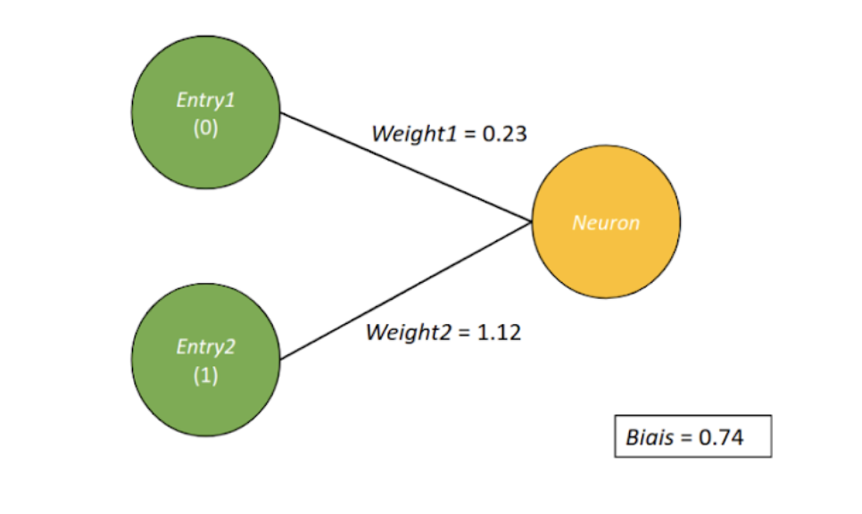
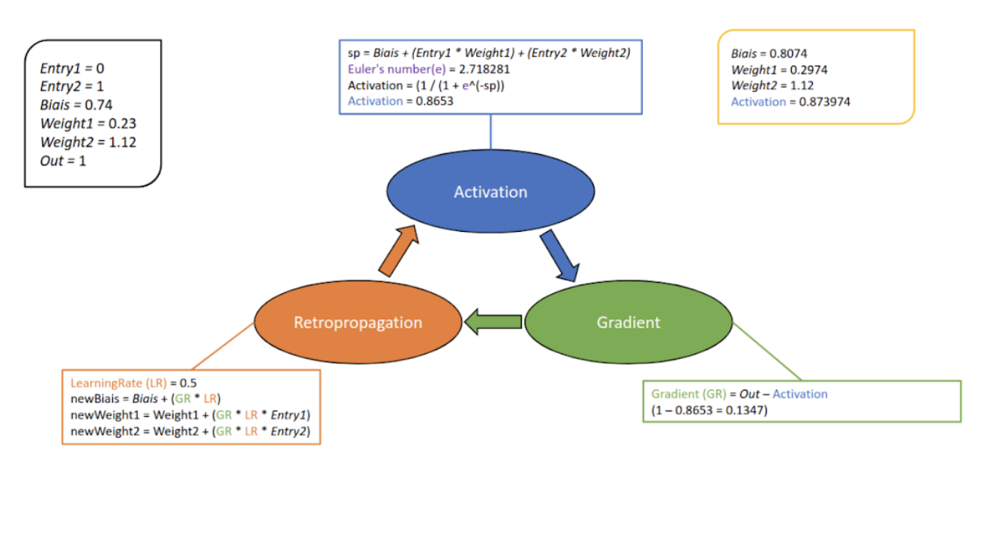
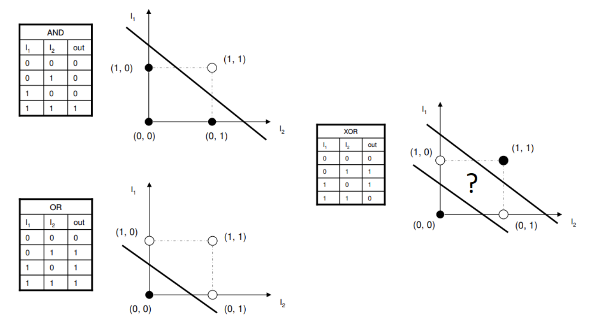

# Workshop

Un réseau de neurones artificiels
est un système dont la conception est à l'origine schématiquement
inspirée du fonctionnement des neurones biologiques.
 
Les réseaux de neurones sont généralement optimisés par des méthodes d’apprentissage comme le
[supervisé](https://machinelearnia.com/apprentissage-supervise-4-etapes/)
que nous allons découvrir durant ce workshop.
 
 
Nous pouvons en schematiser un comme ceci:

Un réseau de neurones est un ensemble de couches de neurones qui ont chacune une fonctionnalité.
Ici nous pouvons distinguer trois catégories:
 - couche d'input
 - couche cachée
 - couche de sortie

Le but de ce workshop est de vous faire développer un seul et unique neurone.
 

Un neurone va prendre X nombre de valeurs et en ressortir un output.
 
Comme vous pouvez le voir ci-dessus, le neurone stock des poids liés aux inputs ainsi qu'un biais (également un poids mais qui n'est pas lié à un input).
 
 
Afin de ressortir ce fameux output, il va multiplier ses poids avec les inputs qu'on lui aura donné
et y ajouter son biais.
Nous pouvons ensuite comparer cette output avec celui que nous aurions aimer avoir.
 
Prenons l'exemple de la porte logique OR. Nous pouvons constater ci-dessus que nous envoyons
0 et 1 en inputs (Entry1/Entry2). D'après la porte OR l'output devrait être égal 1.
 
Pour que notre neurone ressorte ce même output, vous allez devoir l'entraîner!
 
Vous allez adapter ses poids afin qu'il se rapprochent le plus du résulat attendu.

# Exercice

En suiviant le shéma ci-dessus, créer une classe "Neuron" qui prend un paramètre le nombre d'inputs du neurone.
 
[tuto class python](https://www.w3schools.com/python/python_classes.asp)

Attributs:
- "_activate" nombre initialisé à 0.
- "_gradient" nombre initialisé à 0.
- "_bias" nombre aléatoire entre -1 et 1.
- "_weights" liste de nombre aléatoire entre -1 et 1, sa taille est égale au nombre d'inputs.

Méthodes:
- "activation" Cette fonction (sigmoid), servira à set "_activate" de notre classe
- "compute-gradient" Cette fonction, servira à set "_gradient" de notre classe
- "update-weights" changer les poids pour qu'ils s'adaptent à notre résulat attendu.
- "train" prends en paramètre les inputs, les résultats attendu ainsi qu'un taux d'apprentissage (règle l'intensité de l'entrainement).

Réaliser un apprentissage de votre neurone pour la porte logique and.
Pour notre neurone, sa fonction d'activation est une
[sigmoïd](https://fr.wikipedia.org/wiki/Sigmoïde_(mathématiques))
.
 
Son "_activate" sera donc entre 0 et 1. Si l'activation du neurone est >= 0.5, il est égale à 1 et à l'inverse 0.
 
Nous pouvons donc maintenant le comparer à notre résultat attendu.
 
Réfléchissez bien aux valeurs de vos paramètres comme le
[taux d'apprentissage](https://towardsdatascience.com/understanding-learning-rates-and-how-it-improves-performance-in-deep-learning-d0d4059c1c10)
ou même le nombre de fois ou vous allez adapter les poids de votre neurone (Epoch).
 
inputs = [[0, 0], [1, 0], [0, 1], [1, 1]]
 
output = [0, 0, 0, 1]

Afin de voir si votre entraînement fonctionne bien, vous allez implémenter une méthode "compute-loss" à votre classe.
 
Ce genre de fonction, s'appelle fonction de coût. Elle retourne un nombre correspondant à votre erreur
en comparant les valeurs que vous avez à celles que vous attendez.
Plus ce nombre est grand plus votre neurone est dans l'erreur.
 
Vous allez utiliser la fonction "mean_squared_error" de "sklearn.metrics".
 
[en savoir plus sur la fonction](https://en.wikipedia.org/wiki/Mean_squared_error)

# Problème du perceptron

Un neurone seul peut uniquement résoudre des problèmes linéairement résolvables,
comme des portes logiques tel que le OR ou le AND. Le XOR quand à lui n’est pas linéairement résolvable.
 

Nous devons donc utiliser plusieurs perceptrons pour remédier à ce problème.
 
C'est la que les réseaux de neurones entreront en jeux.

Si vous êtes à cet endroit c'est que vous avez atteint le but du workshop.
 
De nombreux frameworks ont été crée afin de pouvoir créer plus facilement des réseaux de neurones.
 
Essayez d'en créer un et de lui faire apprendre la porte XOR avec [Pytorch](https://pytorch.org/) !
