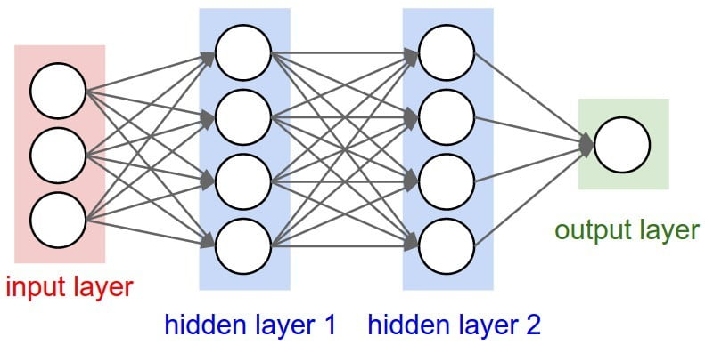
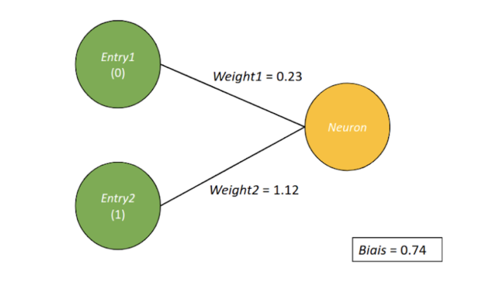
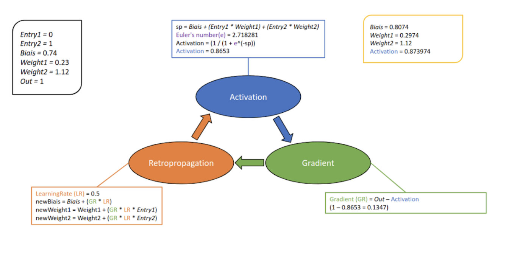
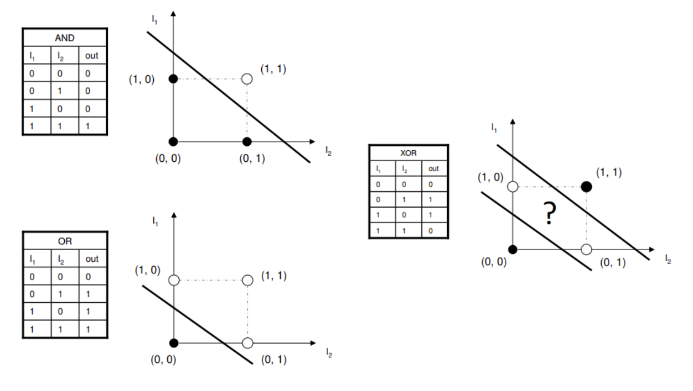

# Workshop

Un réseau de neurones artificiels, ou réseau neuronal artificiel, est un système dont la conception est à l'origine schématiquement inspirée du fonctionnement des neurones biologiques et qui par la suite s'est rapproché des méthodes statistiques.
 
Les réseaux de neurones sont généralement optimisés par des méthodes d’apprentissage de type probabiliste, en particulier bayésien. Ils sont placés d’une part dans la famille des applications statistiques, qu’ils enrichissent avec un ensemble de paradigmes permettant de créer des classifications rapides (réseaux de Kohonen en particulier), et d’autre part dans la famille des méthodes de l’intelligence artificielle auxquelles ils fournissent un mécanisme perceptif indépendant des idées propres de l'implémenteur, et fournissant des informations d'entrée au raisonnement logique formel (voir Deep Learning).
 
 
Nous pouvons en schematiser un comme ceci:

Un réseau de neurones est un ensemble de couches de neurones qui ont chacune une fonctionnalité.
Ici nous pouvons distinguer trois catégories:
 - couche d'input
 - couche cachée
 - couche de sortie

Le but de ce workshop est de vous faire développer un seul et unique neurone.
 

Un neurone va prendre X nombre de valeurs et en ressortir un output.
 
Comme vous pouvez le voir ci-dessus, il stock des poids qui sont liés aux inputs et un biais (également un poids mais qui n'est pas lié à un input).
 
 
Afin de ressortir ce fameux output, il va multiplier ses poids avec les inputs qu'on lui aura donné
et y ajouter son biais, un poids qui ne dépend pas d'un input.
Nous pouvons ensuite comparer cette output avec celui que nous aurions aimer avoir.
 
Prenons l'exmple du or. Si nous avons le même neurone que l'exemple ci-dessus, nous lui envoyons 0 et 1 comme inputs.
 
 
D'après la porte or, l'output devrais être 1 et nous voulons que notre neurone nous ressorte ce même output, vous allez devoir l'entraîner.
 
C'est à dire que vous allez adapter ses poids afin qu'il se rapproche le plus de votre résulats attendu.
 
Cet entraînement se nomme supervisé.
 
[plus d'explications](https://likeabot.io/blog/apprentissage-supervise-et-non-supervise-machine-learning-ia)

#Exercice

En suiviant le shéma ci-dessus, créer une class "Neuron" qui prend un paramètre le nombre d'inputs du neurone

Attributs:
- "_activate" nombre initialisé à 0.
- "_gradient" nombre initialisé à 0.
- "_bias" nombre aléatoire entre -1 et 1.
- "_weights" liste de nombre aléatoire entre -1 et 1, sa taille est égale au nombre d'inputs.

Méthodes:
- "activation" Cette fonction, servira à set "_activate" de notre class
- "compute-gradient" Cette fonction, servira à set "_gradient" de notre class
- "update-weights" changer les poids pour qu'ils s'adaptent à notre résulat attendu.
- "train" prends en paramètre les inputs, les résultats attendu ainsi qu'un taux d'apprentissage (règle l'intensité de l'entrainement).

Réaliser un apprentissage de votre neurone pour la porte logique and.

inputs = [[0, 0], [1, 0], [0, 1], [1, 1]]
 
output = [0, 0, 0, 1]

Afin de voir si votre entraînement fonctionne bien, vous allez implémenter une méthode "compute-loss" à votre class.
 
Ce genre de fonction, s'appelle fonction de coût. Son but est de comparer les valeurs que vous avez à celles que vous attendez et vous donner l'erreur.
 
Vous allez utiliser la fonction "mean_squared_error" de "sklearn.metrics".
 
[en savoir plus sur la fonction](https://en.wikipedia.org/wiki/Mean_squared_error)

# Problème du perceptron

Un seul et unique perceptron ne peut résoudre que des problèmes linéairement résolvables,

comme des portes logiques tel que le “or” ou le “and”. Le “xor” quand à lui n’est pas linéairement résolvable,
 
nous devons donc utiliser plusieurs perceptrons pour remédier à ce problème.
 
C'est la que les réseaux de neurones entreront en jeux.

Si vous êtes à cet endroit du workshop c'est que vous avez atteing le but du workshop.
 
De nombreux frameworks ont été crée afin de pouvoir créer plus facilement des réseaux de neurones notamment.
 
Essayer d'en créer un grâce à [Pytorch](https://pytorch.org/) !
